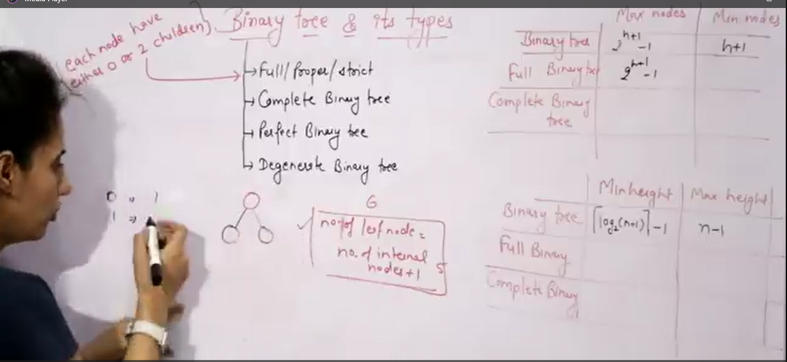
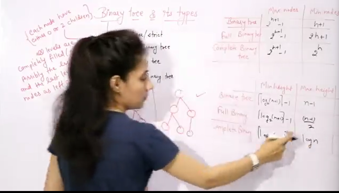

TREES 

Binary trees -- A tree can be defined as a collection of entities(nodes) linked together to simulate a hierarchy

a tree grows and it the tree grows in one direction

root does not have any parent node
child node is the immediate successor of the parent node

leaf node is a node that does not have a child this is also known as external nodes
non-leaf node is a node that 

non-leaf node are nodes that has only one child

path-- is a sequence if consecutive edges from source node to destination node
the links are unidirectional

ancestor -- this is any predecessor node on the path from root to that node 
decendent --  this is any successor node on the path from that node  to the leaf node.

depth-of-node -- length of path from root to that node
height of node -- no of edges in the longest path from that node to a leaf

level of node -- 
node = (n-1)edges

level of tree =  height if the tree

binary tree --  in a binary tree a tree can has at most 2 children

the node in a binary tree increases at a rate of 2
max no of node h = (2^h+1 - 1)
min no of node = h + 1

types of binary tree

1 full binary tree
2 complete 
3 perfect 
4 degenerate

full binary tree -- each node have either 0 or 2 childern except leaf node
no of leaf node = no of internal node + 1

complete -- this is when all the levels are completely free except the last level and the node should be as left as possible.

perfect -- this is when all the internal node contains two childern and all the leaf node at same level
all every perfect binary tree is also complet and full

degenerate -- all the internal node has only one node it can be either left queued or right queued
